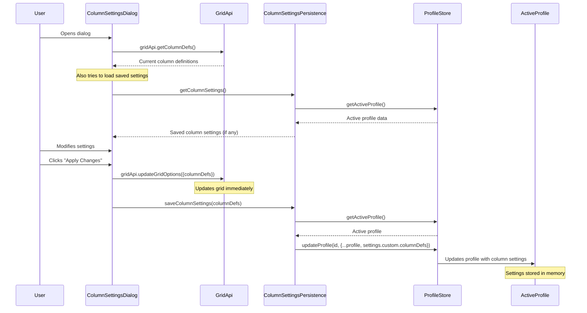
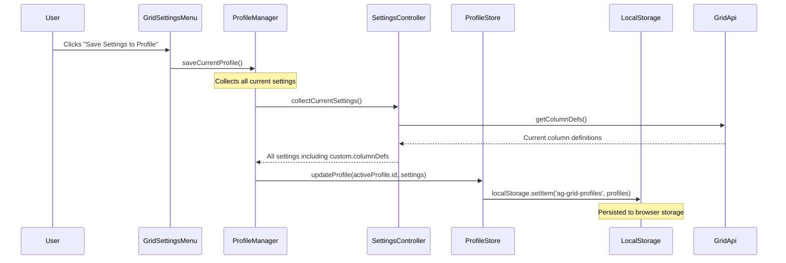
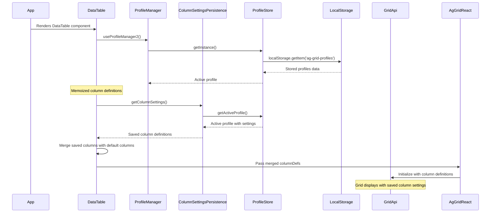
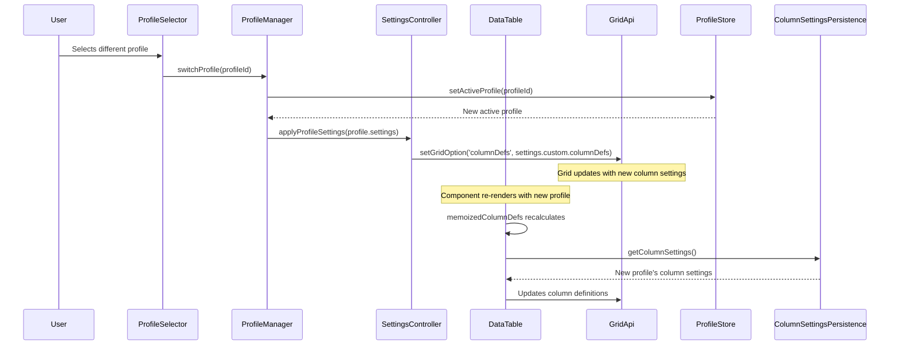

# Column Settings Flow Diagram

## 1. User Modifies Column Settings



## 2. User Saves Profile



## 3. App Load Flow



## 4. Profile Change Flow



## Data Structure

```typescript
// Profile structure in localStorage
{
  profiles: {
    [profileId]: {
      id: string,
      name: string,
      settings: {
        toolbar: {...},
        gridOptions: {...},
        custom: {
          columnDefs: [
            {
              field: 'name',
              headerName: 'Name',
              width: 200,
              // ... other column properties
            },
            // ... more columns
          ]
        }
      }
    }
  },
  activeProfileId: string
}
```

## Key Components

1. **ColumnSettingsDialog**: UI for modifying column settings
2. **ColumnSettingsPersistence**: Utility for saving/loading column settings
3. **ProfileStore**: Manages profile data in localStorage
4. **ProfileManager**: Orchestrates profile operations
5. **SettingsController**: Applies settings to AG Grid
6. **DataTable**: Main grid component that uses saved settings

## Flow Summary

1. **Modifying Settings**: Dialog → Grid API → Profile Store (in memory)
2. **Saving Profile**: Profile Manager → Settings Controller → Profile Store → LocalStorage
3. **Loading on App Start**: LocalStorage → Profile Store → DataTable → Grid API
4. **Profile Switch**: Profile Selector → Profile Manager → Settings Controller → Grid API